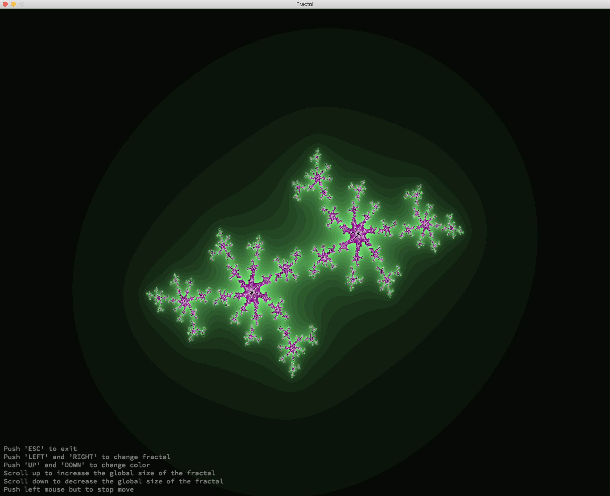

# Fractol-42
The program involves basics of graphic programming with miniLibX

## About
The representation in 3D of a landscape is a critical aspect of modern mapping. This project is about creating a simplified graphic “wireframe” (“fils de fer” in french,
hence the name of the project) representation of a relief landscape linking various points (x, y, z) via segments. The coordinates of this landscape are stored in a file passed as a parameter to your program.

## Installation
1. Download/Clone this repo
```
git clone https://github.com/pankratdodo/Fractol.git
```
2. `cd` into directrory and run `make`
```
make && ./fractol *name_of_fractals*
```

## Main project instructions
#### General Instructions
- Project must be written in C in accordance with [the Norm](https://github.com/R4meau/minishell/blob/master/norme.en.pdf).
- Program cannot have memory leaks.
- No Segmentation fault, bus error, double free, etc.
- Cannot use global variables.
- Must use the miniLibX. Either in the version that is available on the system, or from its sources.
- Allowed to use the following functions:
  - *open, read, write, close*
  - *malloc, free*
  - *perror, strerror*
  - *exit*
  - All the functions defined in the `math` library (-lm and man 3 math)
  - All the functions defined in the `miniLibX` library.
  
#### Mandatory part
- Software should offer at least 3 different types of fractals, including the Julia set, the Mandelbrot set and the Burningship set.
- It must be possible to make the parameter of the Julia set vary only with the mouse(without clicking).
- The mouse wheel zooms in and out, almost infinitely (within the limits of the computer). This is the very principle of fractals.
- You must use at least a few colors to show the depth of each fractal. It’s even better if you hack away on psychedelic effects.
- A parameter is passed on the command line to define what type of fractal will be viewed. If no parameter is provided, or if the parameter is invalid, the program displays a list of available parameters and exits properly.
- Must be able to quit the program by pressing `esc`.
- The use of images from `minilibX` is strongly encouraged.
- Find attached a binary called fractol.



#### Bonus part
- Use 'RIGHT' and 'LEFT' to change fractal.
- Use 'UP' and 'DOWN' to change color.
- Use mouse wheel to zoom.
- Multi-threading implementation.
- The zoom follow the actual mouse position.
- Any number of valid parameters in the command line, resulting in same number of fractals in same number of windows.
- Name of fractal in any case('JULIA'/'julia'/'JuLiA' and etc).
- Add other fractals named the Heart, the the Mandelbar, the Celtic, the MandFive and the BurnFive.
- Menu to help navigation.
